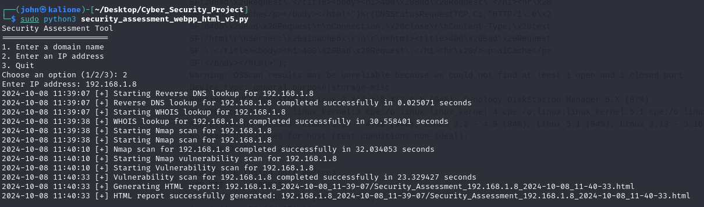
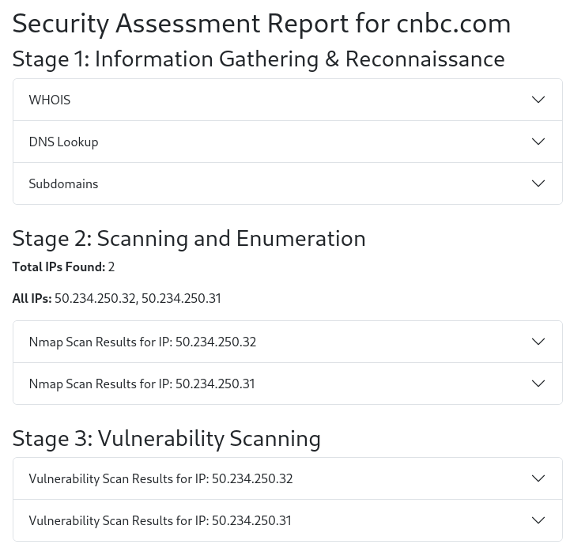
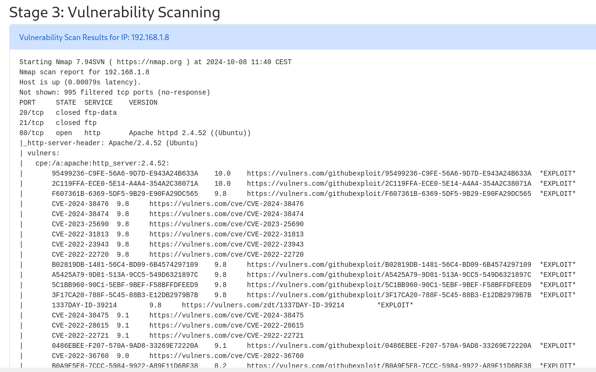

# Security Assessment Tool

The Security Assessment Tool is a Python-based utility that automates security assessments for domains and IP addresses. It performs WHOIS lookups, DNS queries, subdomain discovery, Nmap scans, and vulnerability scanning, and generates an easy-to-read HTML report of the results.

## Features

* WHOIS Lookup: Retrieves registration information for domains and IP addresses.
* DNS Lookup: Uses Google DNS (8.8.8.8) to query DNS records.
* Subdomain Discovery: Utilizes Sublist3r to find subdomains associated with a given domain.
* Nmap Scanning: Scans for open ports and services on IP addresses.
* Vulnerability Assessment: Uses Nmap's vulners script to find known vulnerabilities (CVEs) for identified services.
* HTML Report Generation: Compiles all the results into a structured, easy-to-navigate HTML report.

## Install Dependencies

Run the provided install_dependencies.sh script to install the required Python dependencies and external tools.

> chmod +x install_dependencies.sh
./install_dependencies.sh

Alternatively, you can manually install the dependencies:

> pip install -r requirements.txt

> sudo apt-get install -y whois nmap sublist3r

## Ensure External Tools Are Installed
Make sure the following tools are installed:

* whois
* nmap
* sublist3r (for subdomain discovery)

You can install them using the package manager as shown in the installation script.

## Usage

Run the Python script security_assessment_webpp_html_v5.py to perform security assessments on domains or IP addresses.

> sudo python3 security_assessment_webpp_html_v5.py

### Command Line Options
* Option 1: Enter a domain name for assessment (e.g., example.com).
* Option 2: Enter an IP address for assessment (e.g., 192.168.1.1).
* Option 3: Quit the tool.

## Terminal Output Example

Here is a sample terminal output showcasing the usage of the tool:

## HTML Report Example

Below is a screenshot of the generated HTML report after a security assessment:

## Vulnerability Scanning Report

This image shows the vulnerability scanning results from the assessment:

